# Python CLI 工具开发标准 Prompt

> **使用方式：** 先填写下方【需求配置】部分，然后将整个文档作为 Prompt 发送给 AI

---

## 📝 需求配置（请填写）

### 【项目基本信息】
- **项目名称**：（例如：google-flow-downloader）
- **CLI 命令名**：（例如：gflow）
- **包名**：（例如：google_flow_downloader）
- **简短描述**：（一句话说明工具用途）
- **GitHub 用户名**：neosun100

### 【功能需求】
```
（详细描述工具的核心功能，可以包括：）
- 主要功能是什么
- 需要调用哪些 API
- 输入输出是什么
- 特殊需求
- 参考文档或现有代码
```

### 【默认配置】
- **默认输出目录**：~/Code/GenAI/[项目相关目录]
- **环境变量前缀**：（例如：GFLOW_）
- **需要的环境变量**：（例如：SESSION_TOKEN, PROJECT_ID）

### 【特殊需求】
```
（可选，例如：）
- 需要浏览器脚本集成
- 需要支持多个项目
- 需要剪贴板功能（macOS）
- 其他特殊要求
```

---

## 🤖 AI 执行指令

**请严格按照以下流程执行，不要跳过任何步骤：**

---

### 阶段 1: 项目初始化

**任务：** 创建标准项目结构

**执行：**
1. 在 `~/Code/GenAI/` 下创建项目目录
2. 创建以下标准结构：
   ```
   project-name/
   ├── package_name/
   │   ├── __init__.py
   │   └── cli.py
   ├── tests/
   │   └── test_all.py
   ├── docs/
   │   ├── PYPI_PUBLISHING_GUIDE.md
   │   ├── QUICK_REFERENCE.md
   │   └── DEVELOPMENT.md
   ├── scripts/
   │   └── pre-publish-check.sh
   ├── dev_scripts/
   ├── .gitignore
   ├── LICENSE.txt
   ├── README.md
   └── pyproject.toml
   ```

3. 配置 `pyproject.toml`（⚠️ 关键配置）：
   ```toml
   [build-system]
   requires = ["setuptools>=61.0", "wheel"]
   build-backend = "setuptools.build_meta"
   
   [project]
   name = "项目名称"
   version = "1.0.0"
   description = "简短描述"
   authors = [{name = "Author Name"}]
   readme = "README.md"
   license = {text = "MIT"}  # ⚠️ 不要用 {file = "LICENSE"}
   requires-python = ">=3.8"
   keywords = ["关键词1", "关键词2"]
   dependencies = [
       "requests>=2.31.0",
       "rich>=13.0.0",
       "click>=8.1.0",
   ]
   
   [project.scripts]
   cli-name = "package_name.cli:main"
   
   [project.urls]
   Homepage = "https://github.com/neosun100/项目名称"
   
   [tool.setuptools]
   license-files = []  # ⚠️ 必须添加，避免 PyPI 上传错误
   
   [tool.setuptools.packages.find]
   where = ["."]
   include = ["package_name*"]
   ```

4. 创建 `.gitignore`：
   ```
   *.pyc
   __pycache__/
   *.egg-info/
   build/
   dist/
   .DS_Store
   .env
   *.tar.gz
   ```

**验证：** 项目结构创建完成

---

### 阶段 2: 核心功能开发

**任务：** 实现 CLI 命令和核心逻辑

**必须包含的 Rich 组件：**

```python
from rich.console import Console
from rich.progress import (
    Progress, SpinnerColumn, TextColumn, BarColumn,
    DownloadColumn, TransferSpeedColumn, TimeRemainingColumn
)
from rich.panel import Panel
from rich.table import Table
from rich.tree import Tree
from rich import box

console = Console()
```

**进度条标准模板：**

```python
with Progress(
    SpinnerColumn(),
    TextColumn("[bold blue]{task.description}"),
    BarColumn(bar_width=40),
    TextColumn("[progress.percentage]{task.percentage:>3.0f}%"),
    DownloadColumn(),
    TransferSpeedColumn(),
    TimeRemainingColumn(),
    console=console
) as progress:
    task = progress.add_task("[cyan]处理中...", total=total_count)
    
    for item in items:
        # 处理逻辑
        # 统计文件大小
        progress.update(task, advance=1)
```

**结果显示标准模板：**

```python
table = Table(title="📊 结果", box=box.ROUNDED, show_header=False)
table.add_row("✅ 成功", f"[green]{success}[/green] 项")
table.add_row("❌ 失败", f"[red]{failed}[/red] 项") if failed > 0 else None
table.add_row("📦 大小", f"[cyan]{total_mb:.1f}[/cyan] MB")
table.add_row("📊 总计", f"[bold cyan]{total}[/bold cyan] 项")
table.add_row("📁 位置", f"[dim]{output_dir}[/dim]")
console.print(table)
```

**必须实现的功能：**
1. ✅ 自动去重（下载前检查已存在的文件）
2. ✅ 增量更新（支持多次运行）
3. ✅ 使用绝对路径（`Path.home() / "Code/GenAI/..."`）
4. ✅ 环境变量支持
5. ✅ 错误处理和重试
6. ✅ 详细日志输出

**验证：** 核心功能可以正常运行

---

### 阶段 3: 自动化测试

**任务：** 创建完整的测试套件

**创建 `tests/test_all.py`，必须包含：**

1. ✅ 测试安装（命令存在、版本号）
2. ✅ 测试所有命令的帮助文档
3. ✅ 测试核心功能
4. ✅ 测试参数验证
5. ✅ 测试边界条件
6. ✅ 测试工具函数（Cookie 解析、ID 提取等）

**测试必须输出：**
```
测试结果: X 通过, 0 失败
✅ 所有测试通过！可以安全发布
```

**验证：** 运行 `python3 tests/test_all.py` 全部通过

---

### 阶段 4: 发布前检查脚本

**任务：** 创建 `scripts/pre-publish-check.sh`

**必须包含的检查：**
1. ✅ 运行所有测试
2. ✅ 检查隐私信息（敏感词、email、ID）
3. ✅ 清理并构建包
4. ✅ 检查包格式
5. ✅ 检查 METADATA 中的 Dynamic 字段

**脚本模板：**
```bash
#!/bin/bash
set -e

echo "🚀 发布前检查..."

# 1. 测试
python3 tests/test_all.py

# 2. 隐私检查
if grep -r "敏感词" --include="*.py" --include="*.toml" --include="*.md" --exclude-dir=build . 2>/dev/null; then
    echo "❌ 发现隐私信息"
    exit 1
fi

# 3. 构建
rm -rf build dist *.egg-info
python3 -m build > /dev/null 2>&1

# 4. 检查包
twine check dist/* > /dev/null 2>&1

# 5. 检查元数据
if unzip -p dist/*.whl */METADATA | grep -i "^Dynamic:" > /dev/null 2>&1; then
    echo "⚠️  发现 Dynamic 字段"
fi

echo "✅ 所有检查通过！"
```

**验证：** 运行脚本无错误

---

### 阶段 5: 文档编写

**任务：** 创建符合 GitHub 最佳实践的文档

**README.md 必须包含：**

```markdown
<div align="center">

# 🎯 项目名称

**一句话描述**

[](https://pypi.org/project/package-name/)
[](https://pypi.org/project/package-name/)
[](https://opensource.org/licenses/MIT)
[](https://pepy.tech/project/package-name)

[安装](#-安装) • [快速开始](#-快速开始) • [功能](#-功能特性) • [文档](#-文档)

</div>

---

## 📖 简介

（详细介绍）

**为什么选择这个工具？**
- 🚀 特性1
- 📦 特性2
- 🎯 特性3

---

## 🚀 安装

```bash
pipx install package-name
```

**链接：**
- 📦 PyPI: https://pypi.org/project/package-name/
- 💻 GitHub: https://github.com/neosun100/package-name

---

## ⚡ 快速开始

（3-5个步骤的快速上手）

---

## ✨ 功能特性

<table>
<tr>
<td width="50%">

### 🎯 特性1
描述

</td>
<td width="50%">

### 📦 特性2
描述

</td>
</tr>
</table>

---

## 📚 命令详解

### `cli-name command1`
（详细说明）

---

## 🔧 配置

### 默认输出目录
### 环境变量

---

## 💡 常见问题

<details>
<summary><b>问题1</b></summary>
答案
</details>

---

## 🛠️ 工作原理

```mermaid
graph LR
    A[步骤1] --> B[步骤2]
    B --> C[步骤3]
```



---

## 🧪 测试

```bash
python3 tests/test_all.py
```

---

## 🤝 贡献

欢迎提交 Issue 和 Pull Request！

1. Fork 本仓库
2. 创建特性分支
3. 提交更改
4. 推送到分支
5. 开启 Pull Request

---

## 📄 许可证

MIT License

---

## 🙏 致谢

- 相关项目

---

## 📊 统计


---

<div align="center">

**如果这个项目对你有帮助，请给个 ⭐️ Star！**

Made with ❤️ by [neosun100](https://github.com/neosun100)

</div>
```

**其他必需文档：**
- `docs/PYPI_PUBLISHING_GUIDE.md` - PyPI 发布完整指南
- `docs/QUICK_REFERENCE.md` - 快速参考
- `docs/DEVELOPMENT.md` - 开发指南

**验证：** 所有文档创建完成

---

### 阶段 6: PyPI 发布

**任务：** 发布到 PyPI

**执行步骤：**

```bash
# 1. 运行发布前检查
cd ~/Code/GenAI/project-name
./scripts/pre-publish-check.sh

# 2. 确认检查通过后，发布到 PyPI
source ~/.env
twine upload dist/* -u "$PYPI_USERNAME" -p "$PYPI_PASSWORD"
```

**⚠️ 关键经验：**

如果遇到 `InvalidDistribution: unrecognized or malformed field 'license-file'` 错误：

1. 检查 `pyproject.toml` 是否包含：
   ```toml
   [tool.setuptools]
   license-files = []
   ```

2. 检查 METADATA：
   ```bash
   unzip -p dist/*.whl */METADATA | grep -i "^Dynamic:"
   # 应该无输出
   ```

3. 如果有 Dynamic 字段，重新构建：
   ```bash
   rm -rf build dist *.egg-info
   python3 -m build
   ```

**验证：** PyPI 页面可访问

---

### 阶段 7: GitHub 推送

**任务：** 推送代码到 GitHub

**⚠️ 重要：macOS 系统特殊处理**

**步骤 1: 检测系统**
```python
import platform
is_macos = platform.system() == "Darwin"
```

**步骤 2: 如果是 macOS，使用 SSH MCP 工具**

```bash
# 2.1 创建 GitHub 仓库
create_repository(
    name="项目名称",
    description="项目描述",
    private=False,
    autoInit=False
)

# 2.2 查找 nginx 服务器
ssh_list_servers  # 找到 nginx

# 2.3 打包项目
cd ~/Code/GenAI
tar -czf project.tar.gz project-name/

# 2.4 上传到 nginx
ssh_upload(
    server="nginx",
    localPath="~/Code/GenAI/project.tar.gz",
    remotePath="/tmp/project.tar.gz"
)

# 2.5 在 nginx 服务器上推送
ssh_execute(
    server="nginx",
    command="""
cd /tmp && 
rm -rf project-name &&
mkdir project-name &&
tar -xzf project.tar.gz -C project-name --strip-components=1 &&
cd project-name &&
git config --global --add safe.directory /tmp/project-name &&
git remote add origin https://github.com/neosun100/项目名称.git &&
git push -u origin main --tags &&
rm -rf /tmp/project*
"""
)

# 2.6 清理本地临时文件
rm -f ~/Code/GenAI/project.tar.gz
```

**步骤 3: 如果是其他系统**

```bash
cd ~/Code/GenAI/project-name
git remote add origin https://github.com/neosun100/项目名称.git
git push -u origin main --tags
```

**验证：** GitHub 仓库可访问，代码已推送

---

### 阶段 8: 验证发布

**任务：** 验证 PyPI 和 GitHub 发布

**执行：**

```bash
# 1. 卸载本地版本
pipx uninstall package-name

# 2. 从 PyPI 安装
pipx install package-name

# 3. 测试命令
cli-name --version
cli-name --help

# 4. 运行测试
cd ~/Code/GenAI/project-name
python3 tests/test_all.py

# 5. 测试核心功能
cli-name status
```

**验证：** 所有命令正常工作

---

### 阶段 9: 清理临时文件

**任务：** 清理开发过程中的临时文件

**执行：**

```bash
cd ~/Code/GenAI

# 列出相关的临时文件
ls -1 | grep -iE "项目关键词.*\.(py|js)$" | grep -v "project-name"

# 确认后删除
# 只删除临时开发文件，保留：
# ✅ project-name/ (项目目录)
# ✅ project_output/ (输出目录)
```

**验证：** 只保留项目目录和输出目录

---

## 🎯 质量检查清单

发布前必须确认以下所有项：

### 代码质量
- [ ] ✅ 所有路径使用绝对路径
- [ ] ✅ 环境变量支持
- [ ] ✅ 自动去重功能
- [ ] ✅ 增量更新支持
- [ ] ✅ 错误处理完善
- [ ] ✅ Rich UI 完整集成

### 测试覆盖
- [ ] ✅ 至少 8 个测试
- [ ] ✅ 所有测试通过
- [ ] ✅ 覆盖所有命令
- [ ] ✅ 参数验证测试

### 文档完整性
- [ ] ✅ README 符合 GitHub 最佳实践
- [ ] ✅ 包含徽章和图标
- [ ] ✅ 包含折叠 FAQ
- [ ] ✅ 包含 Mermaid 流程图
- [ ] ✅ 4个文档全部创建

### 安全性
- [ ] ✅ 无隐私信息泄漏
- [ ] ✅ 无硬编码凭据
- [ ] ✅ 敏感信息使用环境变量

### 发布状态
- [ ] ✅ PyPI 发布成功
- [ ] ✅ GitHub 推送成功
- [ ] ✅ 远程安装验证通过
- [ ] ✅ Git 标签已创建

### 清理状态
- [ ] ✅ 临时文件已删除
- [ ] ✅ 服务器临时文件已清理
- [ ] ✅ 只保留项目目录和输出目录

---

## 🚨 关键陷阱（必读）

### 陷阱 1: PyPI license-file 错误

**症状：**
```
ERROR InvalidDistribution: unrecognized or malformed field 'license-file'
```

**解决：**
```toml
[project]
license = {text = "MIT"}  # 不要用 {file = "LICENSE"}

[tool.setuptools]
license-files = []  # 必须添加
```

**验证命令：**
```bash
unzip -p dist/*.whl */METADATA | grep -i "^Dynamic:"
# 应该无输出
```

### 陷阱 2: 相对路径问题

**错误：**
```python
OUTPUT_DIR = "./output"  # ❌
```

**正确：**
```python
OUTPUT_DIR = Path.home() / "Code/GenAI/output"  # ✅
```

### 陷阱 3: macOS 无法推送 GitHub

**原因：** 本地机器没有 GitHub 推送权限

**解决：** 使用 SSH MCP 工具通过 nginx 服务器推送

### 陷阱 4: 忘记去重

**必须实现：**
```python
def get_existing_items(output_dir):
    """扫描已存在的项目"""
    # 返回已存在项目的 set
    
# 下载前过滤
to_download = [item for item in all_items if item not in existing]
```

### 陷阱 5: 进度条不完整

**必须包含：**
- SpinnerColumn
- BarColumn
- DownloadColumn
- TransferSpeedColumn
- TimeRemainingColumn

---

## 📖 参考资料

### 成功案例
- 📦 [google-flow-downloader](https://github.com/neosun100/google-flow-downloader)
- 🔗 [PyPI](https://pypi.org/project/google-flow-downloader/)

### 相关文档
- [PyPI 发布指南](./PYPI_PUBLISHING_GUIDE.md)
- [快速参考](./QUICK_REFERENCE.md)

---

## 🎓 最佳实践总结

### 1. 项目结构
```
标准结构 + 清晰分层 + 完整文档
```

### 2. Rich UI
```
完整进度条 + 美观表格 + 统一配色
```

### 3. 测试
```
自动化 + 全覆盖 + 发布前检查
```

### 4. 发布
```
PyPI (避免 license-file) + GitHub (macOS 用 nginx)
```

### 5. 文档
```
GitHub 最佳实践 + 徽章 + 图标 + FAQ + 流程图
```

---

## ⏱️ 预期时间

- 项目初始化：5-10 分钟
- 核心开发：20-30 分钟
- 测试开发：10-15 分钟
- 文档编写：15-20 分钟
- PyPI 发布：5-10 分钟
- GitHub 推送：5-10 分钟
- 清理验证：5 分钟

**总计：60-100 分钟**

---

## 🎯 成功标准

项目完成的标志：

1. ✅ `pipx install package-name` 在任何机器上成功
2. ✅ 所有命令正常工作
3. ✅ 测试全部通过（X/X）
4. ✅ GitHub 仓库完整且美观
5. ✅ PyPI 页面正常显示
6. ✅ README 专业且信息完整
7. ✅ 无任何隐私信息泄漏
8. ✅ 临时文件已清理

---

<div align="center">

**请将填写完成的整个文档作为 Prompt 发送给 AI**

**AI 将严格按照流程执行，确保每个阶段都完成并验证**

</div>

---

**版本：** v2.0  
**更新：** 2026-01-20  
**状态：** ✅ 生产就绪
